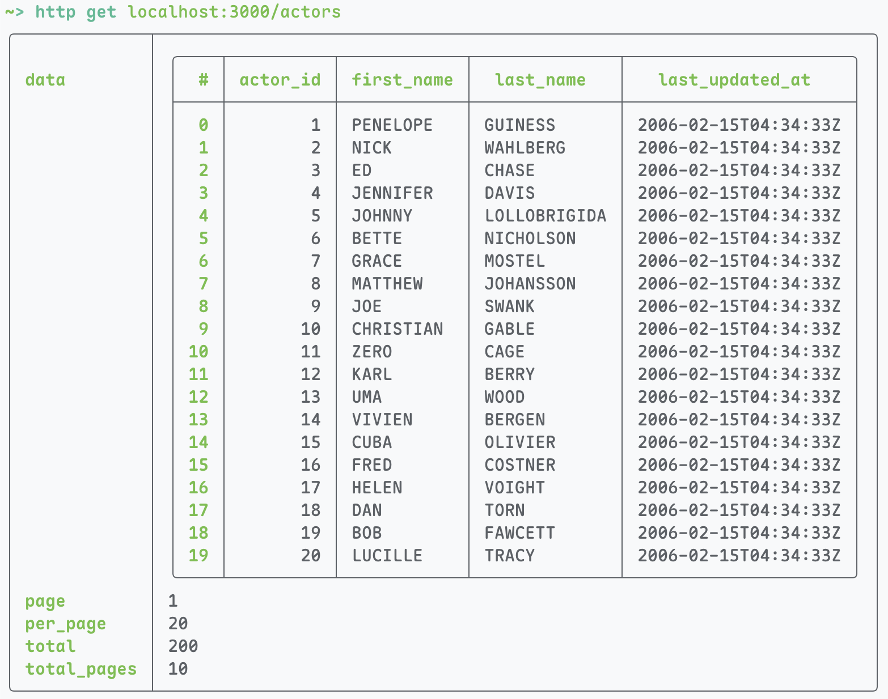
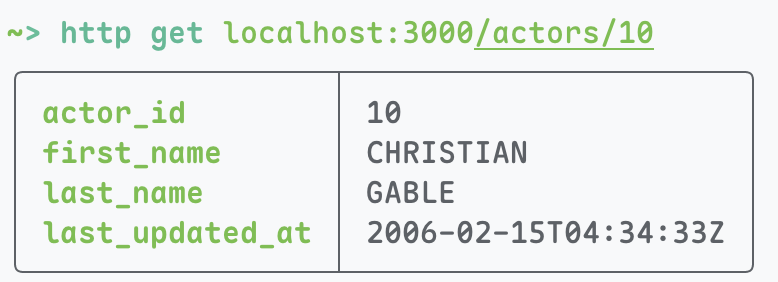
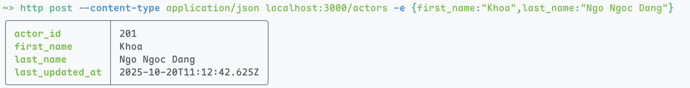
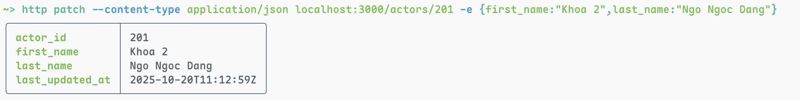
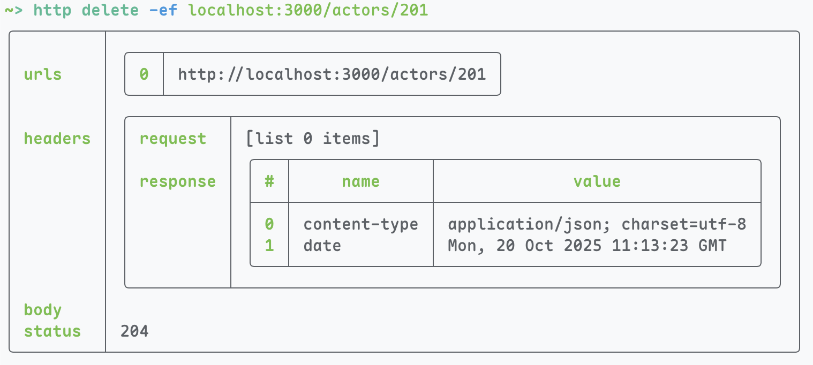
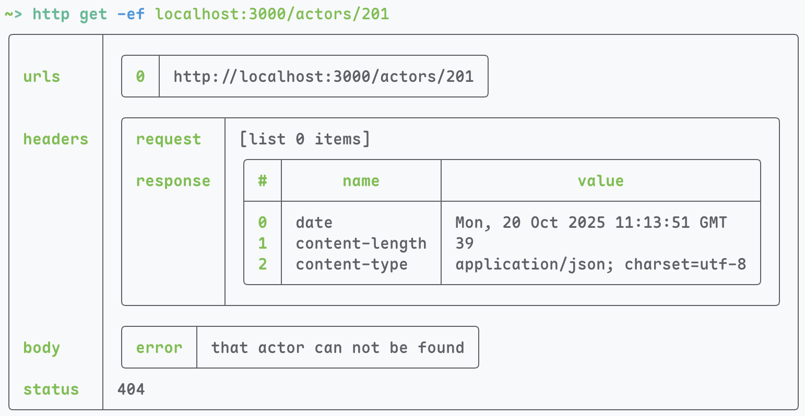

# Week 1

## Objective

Build a RESTful API that provides the following features:

- View a list of all actors.
- View detail of an actor.
- Add a new actor.
- Delete an actor.
- Update an actor.

## Installation

This requires the following environment variables:

- `MYSQL_DSN`: The DSN string for MySQL Connection. It is usually in the form
  `username:password@protocol(host:port)/dbname`. An example that I used for the
  Docker Compose set is `sakila:password@tcp(awad-mysql:3306)/sakila`. You can
  view the provided `.env` for this.

### Docker

Please refer to the root `docker-compose.yml` and [README.md](../README.md).

### Native

```bash
go mod download
go run
```

## Technology Stack

Traceable Go libraries:

- `gorm.io/gorm`: Go's ORM for Relational Databases.
- `gorm.io/driver/mysql`: GORM's MySQL driver.
- `github.com/joho/godotenv`: Go's `.env` loader.
- `github.com/gin-gonic/gin`: The GIN Web Framework.

## API Routes

- `GET /actors?page=1&per_page=20`: View a list of actors.
- `GET /actors/:id`: View a specific actor with ID.
- `POST /actors`: Create a new actor.
- `PATCH /actors/:id`: Edit an existing actor.
- `DELETE /actors/:id`: Delete an existing actor.

## Screenshots

GET:


GET ID:


POST:


PATCH:


DELETE:


GET after DELETE:

