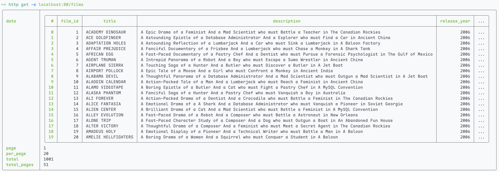
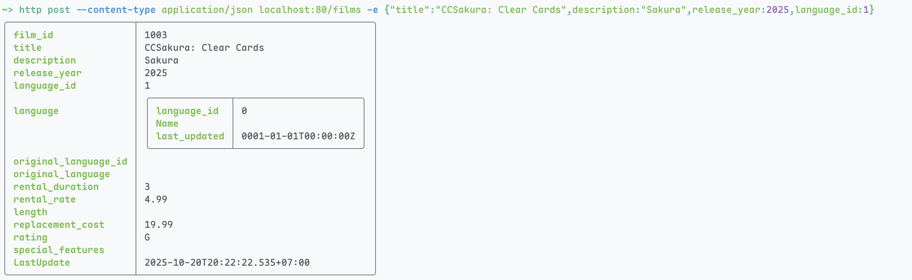
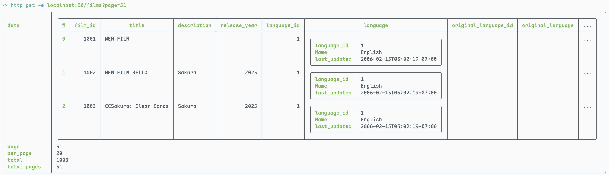
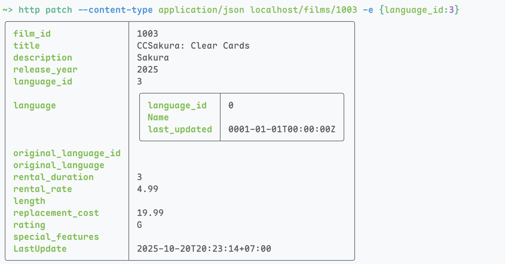
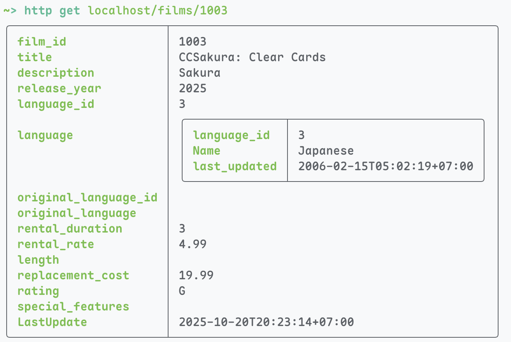
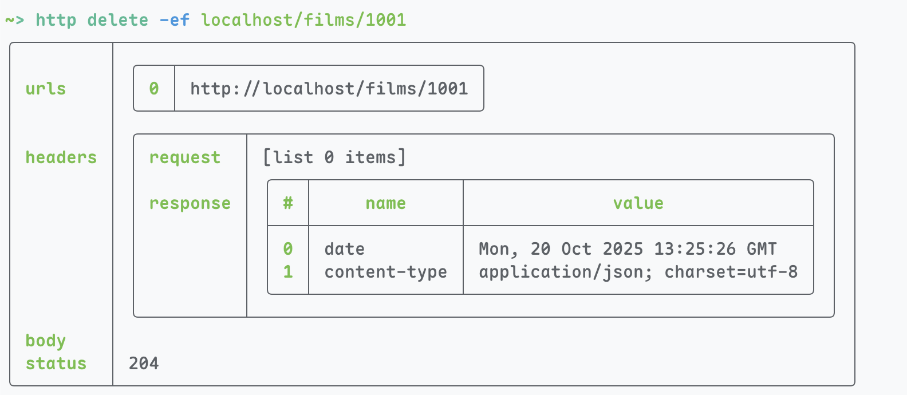
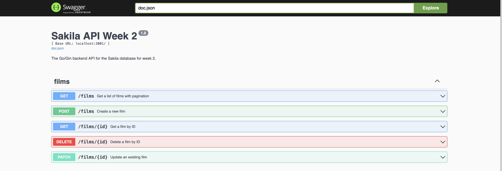

# Week 2

## Objective

Builds a RESTful API that provides the following techniques:

- Validate client parameters (number of fields, datatype, field value)
- Documentation with OpenAPI/Swagger

## Installation

This requires the following environment variables:

- `MYSQL_DSN`: The DSN string for MySQL Connection. It is usually in the form
  `username:password@protocol(host:port)/dbname`. An example that I used for the
  Docker Compose set is `sakila:password@tcp(awad-mysql:3306)/sakila?parseTime=True&loc=Local`.

### Docker

Please refer to the root `docker-compose.yml` and [README.md](../README.md).

### Native

```bash
go mod download
go run
```

## Technology Stack

Traceable Go libraries:

- `gorm.io/gorm`: Go's ORM for Relational Databases.
- `gorm.io/driver/mysql`: GORM's MySQL driver.
- `github.com/joho/godotenv`: Go's `.env` loader.
- `github.com/gin-gonic/gin`: The GIN Web Framework.
- `github.com/swaggo/files`: Dependency for Swaggo to generate files.
- `github.com/swaggo/gin-swagger`: The Swaggo implementation for GIN.
- `github.com/swaggo/swag`: The CLI command to generate a documentation JSON or YAML.

## API Routes

- `GET /films?page=1&per_page=20`: View a list of films.
- `GET /films/:id`: View a specific film with ID.
- `POST /films`: Create a new film.
- `PATCH /films/:id`: Edit an existing film.
- `DELETE /films/:id`: Delete an existing film.

## How to?

### Validation

Validation is done through GIN's binding mechanics using Go's native validators.

```go
// PostFilmBody represents the required data for creating a new film.
// Generated by Gemini
type PostFilmBody struct {
 // REQUIRED FIELDS
 Title string `json:"title" binding:"required,max=255"`

 // language_id is NOT NULL in DB, so it's required here
 LanguageID uint8 `json:"language_id" binding:"required,gte=1"`

 // rental_duration is NOT NULL and has a default, but still required for clarity
 RentalDuration *uint8 `json:"rental_duration" binding:"omitempty,gte=1" gorm:"default:3"`

 // rental_rate is NOT NULL and has a default
 RentalRate *float32 `json:"rental_rate" binding:"omitempty,gt=0"`

 // replacement_cost is NOT NULL and has a default
 ReplacementCost *float32 `json:"replacement_cost" binding:"omitempty,gt=0"`

 // OPTIONAL FIELDS
 Description *string `json:"description" validate:"omitempty"`
 ReleaseYear *int16  `json:"release_year" validate:"omitempty,min=1901,max=2155"` // YEAR(4) range

 // Original language is nullable
 OriginalLanguageID *uint8 `json:"original_language_id" validate:"omitempty,gte=1"`

 Length *uint16 `json:"length" validate:"omitempty,gte=1"`

 // rating must be one of the enum values
 Rating *string `json:"rating" validate:"omitempty,oneof=G PG PG-13 R NC-17" gorm:"default:G"`

 // special_features uses your custom StringSet type
 SpecialFeatures *utils.StringSet `json:"special_features" validate:"omitempty"`

 // Note: FilmID and LastUpdate are omitted as they are auto-generated by the DB/GORM.
}
```

For example on `Title`, which maps to the field `title` in a JSON body, is a
_required_ field and has a max length of `255`.

Other notable validations are:

- `gte=1` means greater than or equal to 1.
- `omitempty` means ignore the condition if the component is `null` or `nil` in Go.
- `oneof=` for enumeration values.
- Use a custom struct (`utils.StringSet`) that implements two interfaces (Scanner
  and Value), would still be okay.

### Swagger UI

Swagger is generated with the command line `swag` installed by `swaggo/swag`.
It should reside somewhere around `~/go/bin/swag`.

```bash
~/go/bin/swag init
```

This will collect all functions that provide a set of comments that match up
Swaggo API comments.

```go
// GetFilms retrieves a page of all films in the database.
//
// @Summary Get a list of films with pagination
// @Description Retrieves a paginated list of films from the database.
// @Tags films
// @Accept json
// @Produce json
// @Param page query int false "Page number (e.g., 1)" default(1)
// @Param per_page query int false "Items per page (e.g., 10)" default(10)
// @Success 200 {object} map[string]interface{} "Successfully retrieved films"
// @Failure 400 {object} map[string]string "Invalid query parameters"
// @Failure 500 {object} map[string]string "Internal server error"
// @Router /films [get]
```

For example, this would create an endpoint called `/films` on Swagger UI, with
the provided information such as tags, summary, description, content types,
parameters, and return values.

## Screenshots

GET:


POST:


GET after POST:


PATCH:


GET ID:


DELETE:


Swagger UI:

