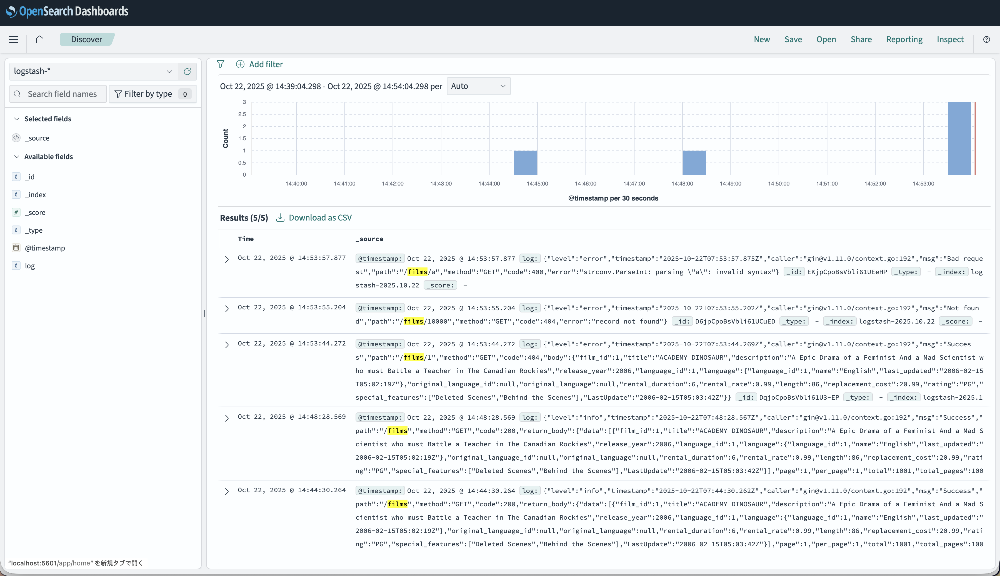

# Week 3

Week 3's main objective is:

- API Logging (to files, or using a tech stack ELK)

## Technology Stack

- Golang 1.25:
  - GIN Web Framework (routing, middlewares, validation)
  - GORM + MySQL Driver (modeling)
  - Zap (Fast file logger)
  - Lumberjack (File rotation)
- OpenSearch (equivalent to Elasticsearch v7.1)
- OpenSearch Dashboard (equivalent to Kibana v7.1)
- FluentBit: A logging system written in C compatible with Logstash (equivalent to Logstash)

Ports used:

- `3002` for GIN Web Framework.
- `9200` and `9400` for OpenSearch (Elasticsearch).
- `3306` for MySQL database.
- `5601` for OpenSearch Dashboards (Kibana).

## Installation

### Docker (Recommended)

Stay at root, and run:

```bash
docker compose --profile week3 up
```

This should setup all necessary services. Make sure to fill in the environment
values as requested with an `.env` file at root directory.

### Native

1. Install OpenSearch (by yourself)
2. Install OpenSearch Dashboard (by yourself)
3. Install Logstash (of course, by yourself)
4. Setup all environment variables for your shell or command prompt. An `.env`
   inside the `week3` folder will also work.
5. Run `go run` in `week3`

## Demonstration



## References

- [FluentBit Manual](https://docs.fluentbit.io/manual/concepts/data-pipeline)
- [Uber-go Zap](https://pkg.go.dev/go.uber.org/zap)
